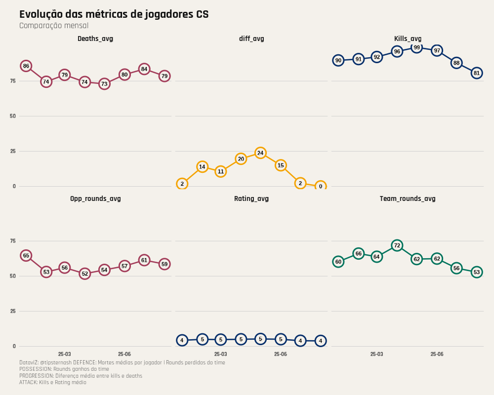

# CS2 Métricas – Gráfico Estilo The Athletic

Bem-vindo ao repositório **CS2 Métricas**, onde analisamos estatísticas detalhadas de partidas de **Counter-Strike 2** e visualizamos os dados em gráficos de alta qualidade, inspirados no estilo da **The Athletic**.

---

## 📊 Gráfico de Métricas

> Este gráfico mostra a **variação das principais métricas** dos jogadores ao longo do tempo.  
> Ele ajuda a identificar tendências de performance e pontos fortes/fracos em partidas de CS2.

---

## 💻 Sobre o Script

O arquivo `cs2-metricas.R` contém o script usado para gerar este gráfico, incluindo:  

- Extração e manipulação de dados com `googlesheets4` e `dplyr`  
- Visualização avançada com `ggplot2` no estilo The Athletic  
- Personalização de cores, fontes e pontos no gráfico  

---

## 📬 Quer me contratar?

Se você está procurando alguém para **analisar métricas de CS2**, criar dashboards ou otimizar estratégias de equipe:  

**Entre em contato comigo!**  

- GitHub: [@devtipsternash](https://github.com/devtipsternash)  
- Email: contatotipsternash@gmail.com  

Vamos transformar dados em vantagem competitiva! 🚀
